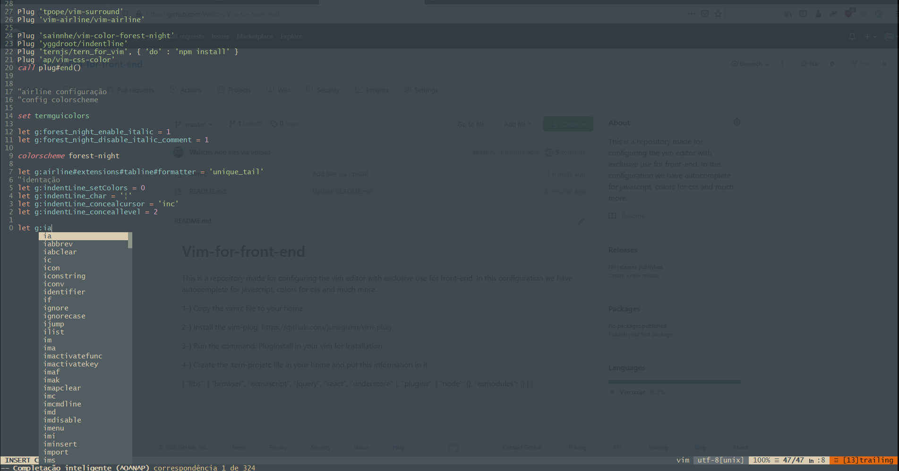

# Vim-for-front-end
This is a repository made for configuring the vim editor with exclusive use for front-end. In this configuration we have autocomplete for javascript, colors for css and much more.

1-) Copy the vimrc file to your home

2-) Install the vim-plug: https://github.com/junegunn/vim-plug

3-) Run the command: PlugInstall in your vim for installation.

4-) Create the .tern-projetc file in your home and put this information in it:

```json
{
  "libs": [
    "browser",
    "ecmascript",
    "jquery",
    "react",
    "underscore"
  ],
  "plugins": {
    "node": {},
    "esmodules": {}
  }
}

```


